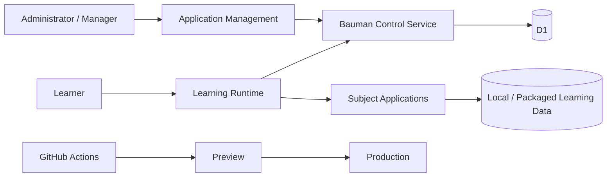

# 01 — As-Is Architecture

Baseline: `c195f2abc4fe0ee6a6cf3f05aab04e814a07d0b2`

## What already exists and should be reused

### Foundation

`foundation/domain-model` already establishes:

- stable canonical IDs: `bd:<kind>:<namespace>:<localId>`;
- knowledge independent from presentation;
- evidence as append-only observation;
- artifact lineage;
- namespaced extensions;
- additive/idempotent migration;
- adapters/providers/renderers preferred before Core schema change.

`foundation/content-registry` already establishes:

- content/asset/source/provenance/checksum/access records;
- SHA-256 integrity;
- append-only provenance;
- canonical locator rules;
- supersession/versioning.

`foundation/learning-content` already establishes:

- renderer-independent lesson standards;
- multimodal learning rhythm;
- evidence ≠ mastery;
- AI-generated material must retain metadata/provenance.

These are valuable foundation beams, not legacy to discard.

### Subject runtimes

Current subjects include:

`ai`, `foundation`, `math`, `programming`, `research`, `russian`, `signal`, `systems`.

Math and Russian already demonstrate rich vertical capabilities, but their manifests, runtime code and content structures are not yet one fully universal extension/content model.

### Host integration

`subjects/shared/host-bridge.js` provides a current subject bridge with:

- subject identity;
- trusted parent-origin checks;
- task receipt;
- ready/progress events.

This is a useful predecessor to a formal Platform SDK/Event/Capability contract.

### Control plane

`control-service` currently owns protected operational behavior including:

- device registration/approval/session;
- content review metadata;
- role-based control actions;
- D1-backed state;
- fail-closed control tickets.

Application Management remains central control-plane owner.

### Runtime and deployment

Cloudflare currently has separated:

- Control Worker;
- Learning Runtime Worker;
- Preview D1;
- Production D1.

Production deploy is manual, exact-preview-revision-first and fail-closed.

## Architectural strengths

- Strong concern for provenance and truthfulness.
- Existing separation between Control and Learning Runtime.
- Mature regression/gate culture.
- Subject packaging and offline work already exist.
- Current-main has real protected invariants rather than only informal conventions.

## Architectural debt / risks

1. **Subject vertical divergence**  
   Rich subjects have accumulated their own runtime history and specialized behavior.

2. **Manifest fragmentation**  
   Subject manifests describe many capabilities/data files but are not yet one universal package/extension contract.

3. **Core-touch risk**  
   Future resources and learning types can still require source changes rather than pure package registration.

4. **UI history accumulation**  
   Repeated subject-level refinement creates risk of visual/interaction divergence.

5. **Academic semantics distributed across runtimes**  
   Prerequisite, progress, assessment and learning evidence are not yet one unified outcome/evidence architecture.

6. **Historical file volume**  
   Many handoff/audit/report files are useful history but increase navigation cost; future governance should separate active architecture from archival evidence.

## As-Is system context

## As-Is conclusion

Bauman has a substantial foundation and release discipline. The next generation should therefore be an **incremental architectural consolidation**, not a rewrite.

