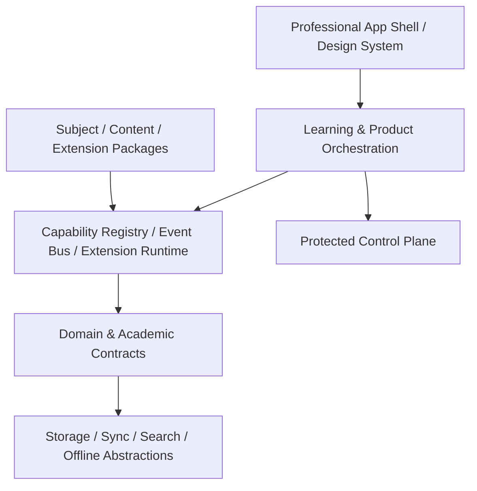
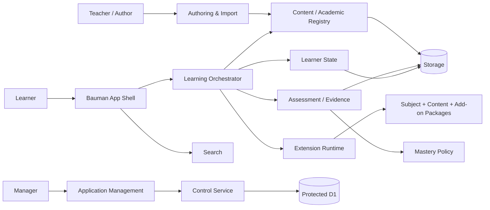

# 02 — Target System Architecture

## Architectural style

Target style:

**Core-stable modular platform + versioned contracts + capability resolution + subject/content packages + isolated extensions.**

The target is neither a microservice explosion nor a single front-end monolith.

## System layers

## Bounded contexts

### Identity & Access
Owns canonical actor/session/access concepts. Does not own learning mastery.

### Content & Provenance
Owns resources, source lineage, package identity, integrity and publication metadata.

### Curriculum & Learning
Owns programs, outcomes, competencies, prerequisites, lessons and learning paths.

### Assessment & Evidence
Owns tasks, submissions, evidence, rubric results and evidence lineage.

### Mastery & Retention
Interprets evidence through explicit policy. Must not be writable by arbitrary plugins or AI.

### Learner State
Owns progress, resume positions, notes, bookmarks and non-authoritative study state.

### Search & Discovery
Indexes domain objects through providers; it does not become source-of-truth storage.

### Extension Runtime
Loads approved capabilities through SDK/registry/sandbox boundaries.

### Control Plane
Owns protected device/admin/review operations and operational authority.

### Reporting & Portfolio
Projects trusted source data into learner/admin views; projection never becomes authority.

## Dependency law

Allowed high-level direction:

`Presentation → Orchestration → Domain services → Ports → Infrastructure`

Forbidden patterns:

- subject UI → D1 directly;
- plugin → mastery mutation directly;
- PDF adapter → learner DB directly;
- AI response → official academic status directly;
- report renderer → source-of-truth mutation.

## Core vs package boundary

**Core contains:** identity contracts, registries, capability/runtime APIs, design system, routing shell, storage/search/offline ports, security policy, learning orchestration primitives.

**Packages contain:** subjects, courses, lesson data, resources, question banks, simulations, domain-specific UI renderers, optional extensions.

## Target system context

## Architectural test

A feature is architecturally healthy when a new instance can be added by configuration/package registration without editing unrelated Core modules.

