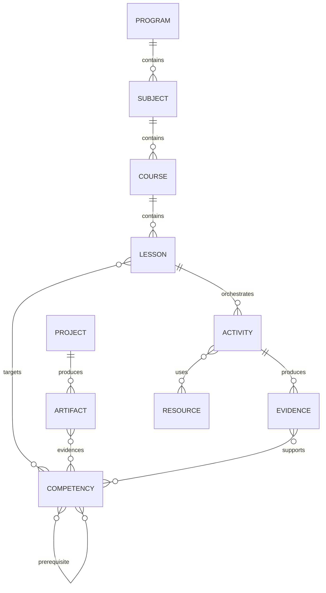

# 04 — Domain and Data Contracts

## Principle

Data contracts are the structural concrete of the platform. They must outlive UI versions.

## Canonical aggregate families

### Academic structure
- Program
- ProgramOutcome
- Subject
- Course
- Chapter
- Lesson
- LearningPath

### Knowledge structure
- Knowledge
- Concept
- Formula
- Misconception
- PrerequisiteRelation

### Capability structure
- Competency
- Skill
- CapabilityRequirement

### Learning structure
- LearningContract
- Activity
- Resource
- ResourceRole

### Assessment structure
- Assessment
- Question
- Submission
- Rubric
- RubricCriterion

### Evidence structure
- Evidence
- EvidenceLink
- EvidenceReview
- MasteryPolicy
- MasteryDecision

### Output structure
- Artifact
- Project
- PortfolioEntry

### Platform structure
- Package
- Manifest
- Extension
- CapabilityProvider
- MigrationRecord

## Common metadata

Published/versioned records should be able to carry:

```text
id
schema
schemaVersion
recordVersion
status
provenance
createdAt
updatedAt
supersedesId
extensions
```

Not every object needs every field, but the lifecycle conventions must be shared.

## Ownership rules

- Content Registry owns resource identity/provenance, not learner mastery.
- Evidence Store owns evidence history, not UI progress.
- Mastery Engine owns mastery decisions, not assessment rendering.
- Learner State owns resume/bookmark/note/progress, not official academic truth.
- Plugin stores may own namespaced extension state only.
- Reporting is projection-only.

## Versioning

Use three distinct concepts:

1. **Schema version** — shape/contract compatibility.
2. **Record/content version** — published content evolution.
3. **Runtime/release revision** — Git/deployment identity.

They must not be conflated.

## Migration rules

- additive first;
- idempotent;
- dry-run/validation before mutation;
- no global storage reset;
- historical evidence never rewritten to look as if created under a new rubric;
- migrations create explicit records where meaning changes.

## Proposed relationship backbone



## Contract gate

A new platform data type cannot enter Core without:

- owner;
- canonical ID policy;
- versioning policy;
- authority boundary;
- migration path;
- validation tests;
- compatibility statement.

