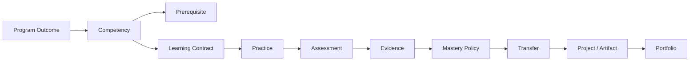

# 06 — Real Learning Architecture

## North Star

Bauman optimizes for **demonstrable capability**, not content consumption.

`Exposure ≠ Progress ≠ Performance ≠ Mastery`

## Academic backbone

## Learning Contract

A lesson/module contract should express:

- why;
- outcomes;
- prerequisites;
- knowledge/concepts;
- skills;
- resources and pedagogical roles;
- guided practice;
- independent practice;
- assessment;
- evidence requirements;
- mastery relationship;
- transfer/review behavior.

The contract is renderer-independent.

## Competency Graph

Competency is an observable capability. It is not a chapter title.

Prerequisite relations must be machine-readable and validated for:

- cycles;
- missing references;
- orphan competencies;
- unreachable pathways.

## Evidence

Evidence is first-class and append-oriented.

Types may include:

- knowledge;
- calculation;
- implementation;
- explanation;
- analysis;
- oral;
- artifact;
- transfer;
- project.

Opening a page, watching a video or talking to AI is not sufficient mastery evidence by itself.

## Mastery

Mastery is computed/interpreted by explicit policy over evidence.

Plugins and AI can produce candidate evidence; they cannot directly grant mastery unless explicitly authorized by policy.

## Real outputs

Major learning stages should culminate, where appropriate, in real artifacts:

- code/notebook;
- report;
- simulation;
- analysis;
- design;
- presentation;
- oral defense;
- research note;
- project.

## Portfolio

Portfolio is evidence-backed, not a decorative file gallery.

A portfolio item links:

`artifact → project/task → competencies → evidence → version/provenance`.

## Academic vs internal authority

Bauman internal mastery/progress must not silently claim official institutional grades, credits or degrees.

Reports state scope and authority.

