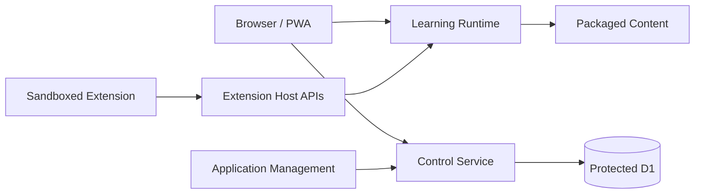

# 08 — Security and Trust Model

## Trust principle

Every boundary is explicit. UI visibility is never authorization.

## Primary trust zones

## Existing protected boundaries to preserve

- server-side Device Gate for protected learning data;
- control tickets/roles fail closed;
- Application Management remains central management/control-plane origin;
- Content Review keeps metadata/reference/hash rather than learning body ownership;
- production deploy preserves Manager-owned shared control secret;
- preview/production stores and origins remain isolated.

## Authority matrix

### Learner
May mutate learner-owned non-authoritative state and submit assessment/evidence through approved APIs.

### Reviewer
May review assigned content/evidence according to policy. No implicit publish authority.

### Publisher/Owner
May perform explicitly protected publication decisions.

### Plugin
May only use declared capabilities and namespaced state.

### AI
May explain/draft/suggest/evaluate within policy; no direct protected mastery/publication authority.

## Extension sandbox

Default external HTML/micro-app policy:

- sandboxed frame;
- explicit origin policy;
- explicit capability grant;
- no secret/cookie access;
- no parent DOM authority;
- no direct storage authority outside namespaced API.

## Data minimization

Store only what a bounded context requires.

Operational control data, learner content, evidence and reporting projections should not collapse into one general-purpose database merely for convenience.

## Security gate categories

- authentication/session;
- authorization/role;
- origin/CORS;
- device enforcement;
- input/schema validation;
- upload/MIME validation;
- iframe/CSP;
- secret ownership;
- ID/reference authorization;
- destructive-action confirmation/idempotency;
- dependency/package integrity.

