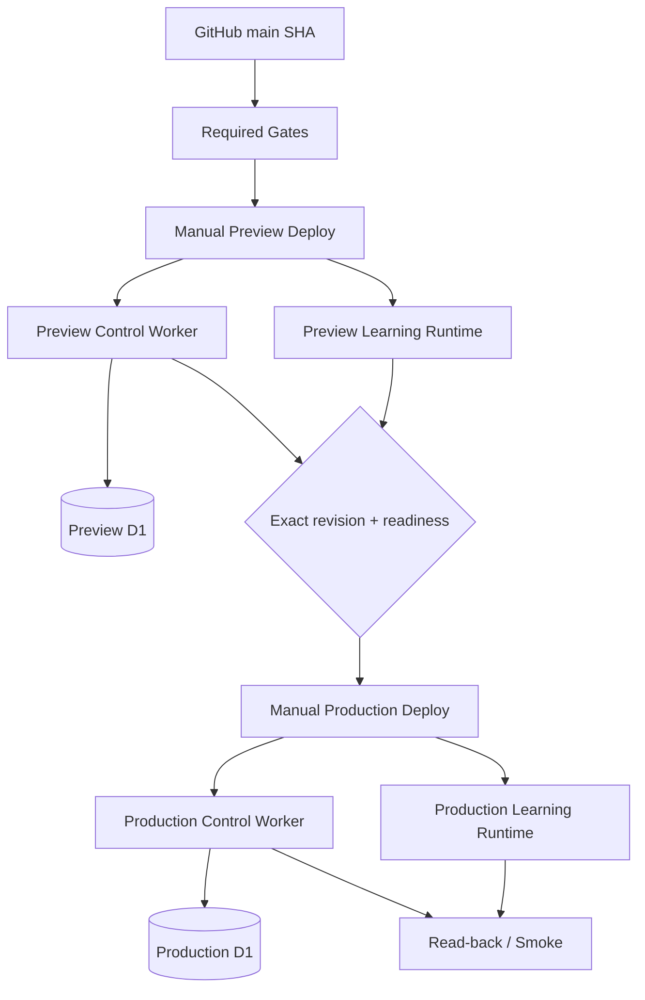

# 09 — Runtime and Deployment Topology

## Current topology retained

Preview and production remain distinct.

## Release invariant

`production SHA == verified live preview SHA == intended main SHA`

A non-empty revision is insufficient.

## Deployment ownership

### Bauman deployment owns
- Bauman runtime artifacts;
- Bauman control/runtime Worker versions;
- Bauman D1 migrations within explicit environment.

### Application Management owns
- central management boundary;
- live shared control secret lifecycle.

Bauman production deployment must not rotate a second competing live control secret.

## Environment isolation

Preview and production must have distinct:

- D1 database IDs;
- worker names/origins;
- deployment channels;
- configuration materialization.

## Mutation ordering

Before production mutation:

1. confirmation token;
2. current source checkout;
3. validators/regressions;
4. exact preview revision verification;
5. production artifact materialization;
6. dry-run;
7. migrations;
8. deploy;
9. exact-revision read-back;
10. smoke.

## Rollback design

Every future architectural wave must define:

- rollback point;
- data compatibility after rollback;
- whether migration is forward-compatible;
- whether feature flags/package disablement can recover without code rollback.

