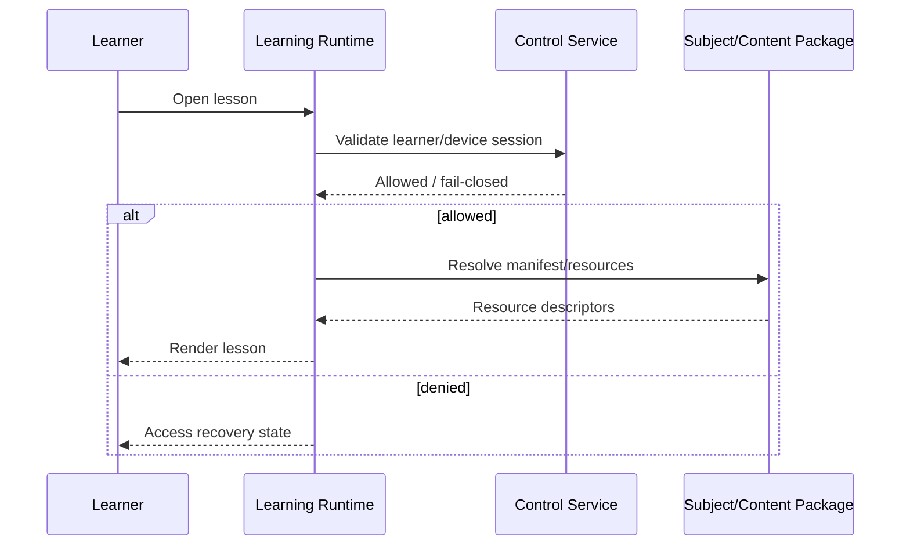
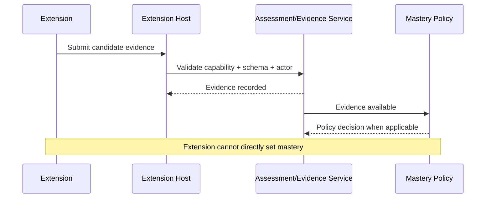
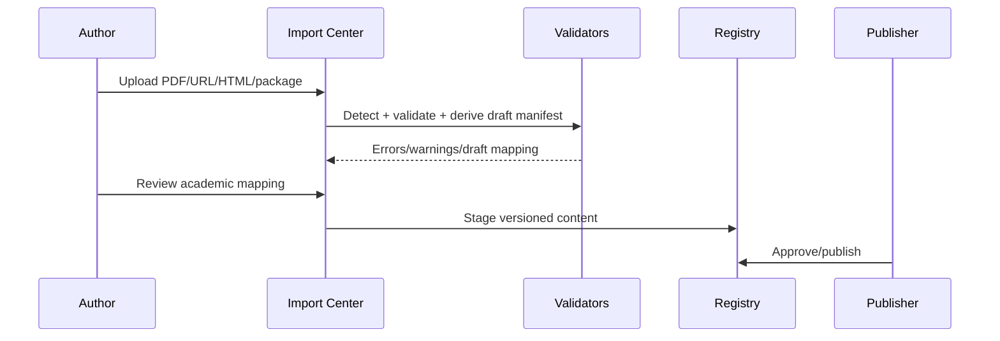
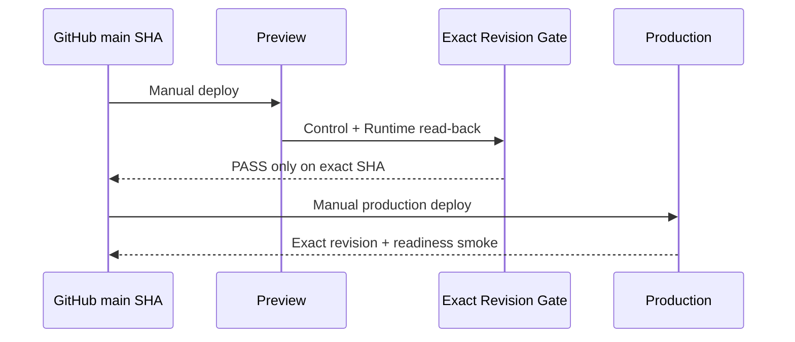

# 19 — Critical Sequence Flows

These sequences are architectural reference flows. Implementations may vary internally but must preserve the authority boundaries.

## Learner opens protected lesson

## Extension produces evidence

## Content import

## Production promotion

## Retry rule

Any sequence containing a retryable mutation must document idempotency semantics before implementation.

