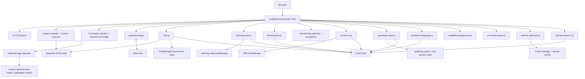

# Russian P1 Current Architecture

Base SHA: `0ed6a1739f8e5010d05f5dc71f4558cf238bb87c`

## Current reality
The product is not a single renderer + single engine. It is a layered runtime where `core.js` remains broad and specialized engines/enhancers mutate/read around it.

This diagram describes present runtime boundaries only; it is not the target architecture.
